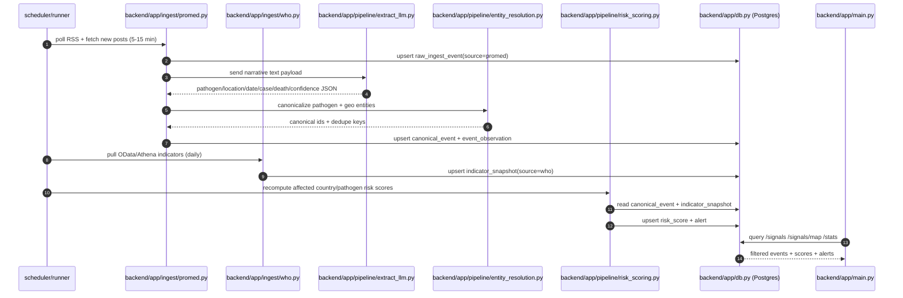
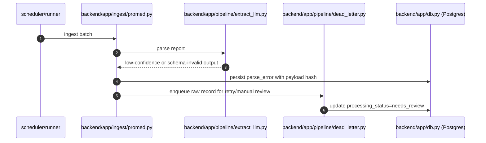

# Edit 1 Pandemic Early Warning Ingestion + Schema Proposal 2026-04-25 17:40 Branch: proposal/pandemic-early-warning-schema-ingestion

## Source Fit Analysis

- `WHO GHO OData API` and `Athena API` are high-quality, structured, country-level epidemiology sources with stable semantics and historical depth. They are best used as a baseline truth layer and calibration backbone, not as first detection signals.
- `ProMED` (RSS + web posts) provides expert-curated but narrative early outbreak signals with weaker structure and noisier timing. It is the primary lead generator for early warning.
- High-ROI architecture: run low-cost frequent ProMED ingestion for speed, then fuse with slower WHO indicator snapshots for context, confidence correction, and risk-score calibration.

## Pandemic Signal Ingestion Sequence (Mermaid)

## Failure Path Sequence (Mermaid)

## Data Schema Proposal

### Design Goals

- Separate immutable raw data from normalized facts.
- Permit multiple observations (sources, updates, corrections) per canonical event.
- Track extraction confidence and provenance for human-auditable early warning.
- Keep schema simple enough for a hackathon MVP, but extensible to production.

### Core Tables

| Table | Purpose | Key Columns |
| --- | --- | --- |
| `source_registry` | Source metadata and polling policy | `id`, `name`, `kind` (`rss`,`api`), `base_url`, `poll_interval_minutes`, `enabled` |
| `raw_ingest_event` | Immutable fetched payloads | `id`, `source_id`, `external_id`, `fetched_at`, `published_at`, `url`, `title`, `raw_text`, `raw_json`, `content_hash` |
| `canonical_event` | De-duplicated outbreak event entity | `id`, `event_key`, `pathogen_id`, `location_id`, `event_start_date`, `status` (`suspected`,`confirmed`,`monitoring`,`closed`) |
| `event_observation` | Source-specific claim about an event | `id`, `canonical_event_id`, `raw_ingest_event_id`, `observed_at`, `case_count`, `death_count`, `transmission_mode`, `novelty_flag`, `extract_confidence`, `verification_state` |
| `indicator_snapshot` | WHO country-level baseline indicators over time | `id`, `source_id`, `indicator_code`, `country_code`, `period_date`, `value`, `unit`, `dim_json` |
| `risk_score` | Computed risk outputs for triage and map views | `id`, `canonical_event_id`, `country_code`, `scored_at`, `risk_value`, `risk_band`, `score_factors_json`, `model_version` |
| `alert` | Actionable notifications generated from thresholds | `id`, `canonical_event_id`, `risk_score_id`, `alert_level`, `trigger_reason`, `created_at`, `acknowledged_at` |
| `pipeline_run` | Operational observability per ingestion/scoring run | `id`, `pipeline_name`, `started_at`, `finished_at`, `status`, `records_in`, `records_ok`, `records_failed`, `error_summary` |

### Minimal SQLAlchemy-Oriented Constraints

- Unique indexes:
  - `raw_ingest_event(source_id, external_id)`
  - `raw_ingest_event(source_id, content_hash)`
  - `canonical_event(event_key)`
  - `indicator_snapshot(source_id, indicator_code, country_code, period_date)`
- Foreign keys:
  - `event_observation.canonical_event_id -> canonical_event.id`
  - `event_observation.raw_ingest_event_id -> raw_ingest_event.id`
  - `risk_score.canonical_event_id -> canonical_event.id`
  - `alert.risk_score_id -> risk_score.id`
- Retention:
  - Keep `raw_ingest_event` immutable and append-only for replay/debug.
  - Use soft deletes only on user-facing entities (`alert` acknowledgements), not ingest logs.

## Ingestion and Scoring Proposal (High ROI)

- Polling cadence:
  - `ProMED RSS`: every 10 minutes.
  - `WHO indicators`: daily refresh, with backfill jobs for missing periods.
- Two-stage extraction:
  - Stage 1 deterministic parsing (RSS metadata, date normalization, URL canonicalization).
  - Stage 2 LLM extraction into strict JSON schema with confidence + rationale fields.
- Entity resolution:
  - Normalize pathogen and country using controlled dictionaries (`iso3`, pathogen aliases).
  - Compute `event_key = hash(pathogen_id + location_id + week_bucket + signal_type)` for dedupe.
- Risk scoring v1 (interpretable):
  - `risk = w1*signal_strength + w2*growth_proxy + w3*severity_proxy + w4*baseline_vulnerability_adjustment`
  - `baseline_vulnerability_adjustment` sourced from WHO indicators (e.g., historical burden, health-system proxies).
- Alerting:
  - Emit alert only when both threshold and minimum confidence are met.
  - Enforce cooldown windows to prevent duplicate alert spam for the same `canonical_event`.

## Implementation Notes

- Proposed module layout:
  - `backend/app/ingest/promed.py`
  - `backend/app/ingest/who.py`
  - `backend/app/pipeline/extract_llm.py`
  - `backend/app/pipeline/entity_resolution.py`
  - `backend/app/pipeline/risk_scoring.py`
  - `backend/app/models/*.py` (SQLAlchemy models for the tables above)
- API endpoints aligned to existing project plan:
  - `GET /signals`
  - `GET /signals/{id}`
  - `GET /signals/map`
  - `POST /ingest/run`
  - `GET /stats`
- Fast win for demo quality:
  - Seed with last 14 days of ProMED posts.
  - Pull 2-4 WHO indicators across 15-30 countries to avoid over-scope.
  - Show before/after calibration: raw narrative score vs WHO-calibrated score.

## Rollout Notes

- Phase 1 (Hackathon MVP): single worker, synchronous ingestion command, SQLite acceptable.
- Phase 2 (Productionizable): move to Postgres + job queue, partition `raw_ingest_event` by month, add idempotent retry semantics.
- Phase 3 (Operational): analyst review queue for low-confidence extractions, feedback loop into extraction prompts and scoring weights.
