# Edit 1 Pandemic Early Warning Ingestion + Schema Proposal 2026-04-25 17:40 Branch: proposal/pandemic-early-warning-schema-ingestion

## Source Fit Analysis

- `WHO GHO OData API` and `Athena API` are high-quality, structured, country-level epidemiology sources with stable semantics and historical depth. They are best used as a baseline truth layer and calibration backbone, not as first detection signals.
- `ProMED` (RSS + web posts) provides expert-curated but narrative early outbreak signals with weaker structure and noisier timing. It is the primary lead generator for early warning.
- High-ROI architecture: run low-cost frequent ProMED ingestion for speed, then fuse with slower WHO indicator snapshots for context, confidence correction, and risk-score calibration.

## Pandemic Signal Ingestion Sequence (Mermaid)

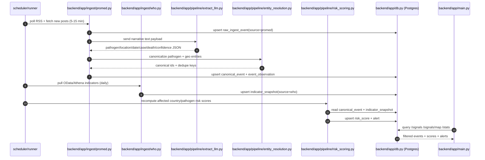

## Failure Path Sequence (Mermaid)

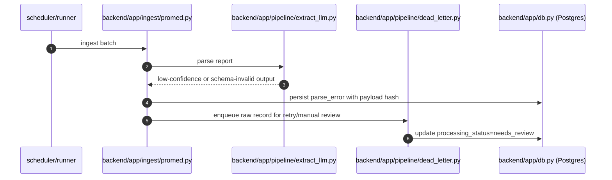

## Data Schema Proposal

### Design Goals

- Separate immutable raw data from normalized facts.
- Permit multiple observations (sources, updates, corrections) per canonical event.
- Track extraction confidence and provenance for human-auditable early warning.
- Keep schema simple enough for a hackathon MVP, but extensible to production.

### Core Tables

| Table | Purpose | Key Columns |
| --- | --- | --- |
| `source_registry` | Source metadata and polling policy | `id`, `name`, `kind` (`rss`,`api`), `base_url`, `poll_interval_minutes`, `enabled` |
| `raw_ingest_event` | Immutable fetched payloads | `id`, `source_id`, `external_id`, `fetched_at`, `published_at`, `url`, `title`, `raw_text`, `raw_json`, `content_hash` |
| `canonical_event` | De-duplicated outbreak event entity | `id`, `event_key`, `pathogen_id`, `location_id`, `event_start_date`, `status` (`suspected`,`confirmed`,`monitoring`,`closed`) |
| `event_observation` | Source-specific claim about an event | `id`, `canonical_event_id`, `raw_ingest_event_id`, `observed_at`, `case_count`, `death_count`, `transmission_mode`, `novelty_flag`, `extract_confidence`, `verification_state` |
| `indicator_snapshot` | WHO country-level baseline indicators over time | `id`, `source_id`, `indicator_code`, `country_code`, `period_date`, `value`, `unit`, `dim_json` |
| `risk_score` | Computed risk outputs for triage and map views | `id`, `canonical_event_id`, `country_code`, `scored_at`, `risk_value`, `risk_band`, `score_factors_json`, `model_version` |
| `alert` | Actionable notifications generated from thresholds | `id`, `canonical_event_id`, `risk_score_id`, `alert_level`, `trigger_reason`, `created_at`, `acknowledged_at` |
| `pipeline_run` | Operational observability per ingestion/scoring run | `id`, `pipeline_name`, `started_at`, `finished_at`, `status`, `records_in`, `records_ok`, `records_failed`, `error_summary` |

### Minimal SQLAlchemy-Oriented Constraints

- Unique indexes:
  - `raw_ingest_event(source_id, external_id)`
  - `raw_ingest_event(source_id, content_hash)`
  - `canonical_event(event_key)`
  - `indicator_snapshot(source_id, indicator_code, country_code, period_date)`
- Foreign keys:
  - `event_observation.canonical_event_id -> canonical_event.id`
  - `event_observation.raw_ingest_event_id -> raw_ingest_event.id`
  - `risk_score.canonical_event_id -> canonical_event.id`
  - `alert.risk_score_id -> risk_score.id`
- Retention:
  - Keep `raw_ingest_event` immutable and append-only for replay/debug.
  - Use soft deletes only on user-facing entities (`alert` acknowledgements), not ingest logs.

## Current Database Schema (Mermaid ERD)

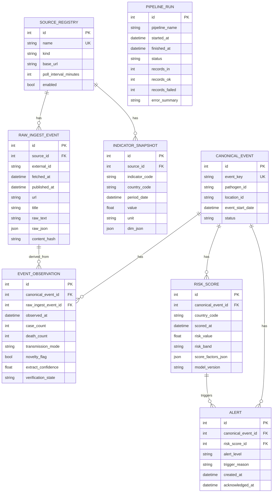

## Ingestion and Scoring Proposal (High ROI)

- Polling cadence:
  - `ProMED RSS`: every 10 minutes.
  - `WHO indicators`: daily refresh, with backfill jobs for missing periods.
- Two-stage extraction:
  - Stage 1 deterministic parsing (RSS metadata, date normalization, URL canonicalization).
  - Stage 2 LLM extraction into strict JSON schema with confidence + rationale fields.
- Entity resolution:
  - Normalize pathogen and country using controlled dictionaries (`iso3`, pathogen aliases).
  - Compute `event_key = hash(pathogen_id + location_id + week_bucket + signal_type)` for dedupe.
- Risk scoring v1 (interpretable):
  - `risk = w1*signal_strength + w2*growth_proxy + w3*severity_proxy + w4*baseline_vulnerability_adjustment`
  - `baseline_vulnerability_adjustment` sourced from WHO indicators (e.g., historical burden, health-system proxies).
- Alerting:
  - Emit alert only when both threshold and minimum confidence are met.
  - Enforce cooldown windows to prevent duplicate alert spam for the same `canonical_event`.

## Implementation Notes

- Proposed module layout:
  - `backend/app/ingest/promed.py`
  - `backend/app/ingest/who.py`
  - `backend/app/pipeline/extract_llm.py`
  - `backend/app/pipeline/entity_resolution.py`
  - `backend/app/pipeline/risk_scoring.py`
  - `backend/app/models/*.py` (SQLAlchemy models for the tables above)
- API endpoints aligned to existing project plan:
  - `GET /signals`
  - `GET /signals/{id}`
  - `GET /signals/map`
  - `POST /ingest/run`
  - `GET /stats`
- Fast win for demo quality:
  - Seed with last 14 days of ProMED posts.
  - Pull 2-4 WHO indicators across 15-30 countries to avoid over-scope.
  - Show before/after calibration: raw narrative score vs WHO-calibrated score.

## Rollout Notes

- Phase 1 (Hackathon MVP): single worker, synchronous ingestion command, SQLite acceptable.
- Phase 2 (Productionizable): move to Postgres + job queue, partition `raw_ingest_event` by month, add idempotent retry semantics.
- Phase 3 (Operational): analyst review queue for low-confidence extractions, feedback loop into extraction prompts and scoring weights.

# Edit 2 Async Orchestration With Celery RabbitMQ 2026-04-25 21:49 Branch: proposal/pandemic-early-warning-schema-ingestion

## Celery Pipeline Sequence (Mermaid)

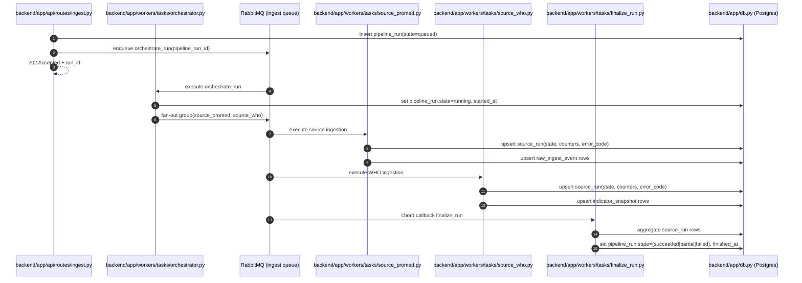

## State Check Sequence (Mermaid)

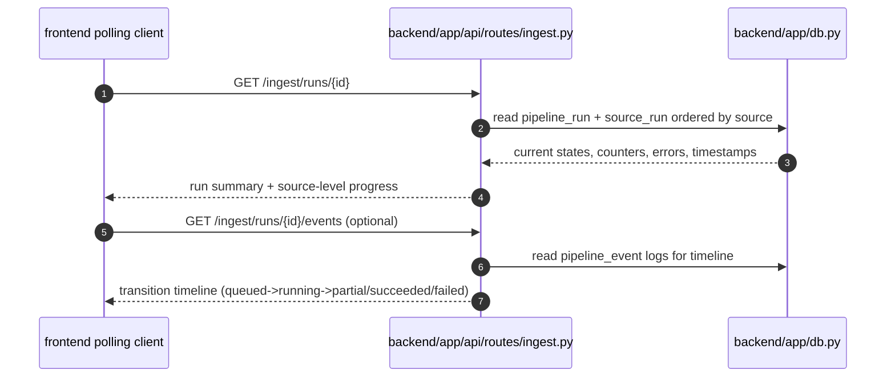

## Proposed Runtime State Machine

- `pipeline_run.state`:
  - `queued`: accepted by API, waiting in queue.
  - `running`: orchestrator started and at least one source task scheduled.
  - `partial`: at least one source failed, at least one source succeeded.
  - `succeeded`: all enabled source tasks succeeded.
  - `failed`: all source tasks failed or orchestration failed before any success.
  - `canceled` (optional): manual cancellation before finalization.
- `source_run.state`:
  - `queued`, `running`, `succeeded`, `failed`, `skipped`.
- Transition guardrails:
  - only finalizer may set terminal `pipeline_run.state`.
  - source tasks are idempotent by `(pipeline_run_id, source_name, shard_key)`.
  - retries update `attempt` and keep latest terminal state per source.

## Schema Additions For Async Control

- Add columns to `pipeline_run`:
  - `state` (replace current overloaded `status`), `queued_at`, `started_at`, `finished_at`, `progress_pct`, `request_id`, `celery_root_task_id`.
- Add new `source_run` table:
  - `id`, `pipeline_run_id`, `source_name`, `state`, `attempt`, `queued_at`, `started_at`, `finished_at`, `records_in`, `records_ok`, `records_failed`, `error_code`, `error_summary`, `task_id`.
- Add optional `pipeline_event` table:
  - append-only transition and warning log (`event_type`, `payload_json`, `created_at`) for UI timeline and incident debugging.
- Recommended indexes:
  - `pipeline_run(state, queued_at desc)`
  - `source_run(pipeline_run_id, source_name)` unique
  - `source_run(state, started_at desc)`

## Proposed Advancement Database Schema (Mermaid ERD)

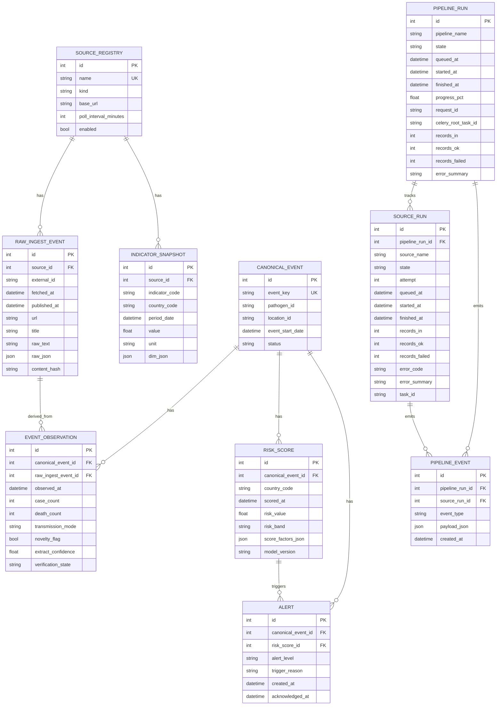

## Folder Organization And Refactor Plan

- `backend/app/api/routes/`
  - `ingest.py` (`POST /ingest/run`, `GET /ingest/runs/{id}`, `GET /ingest/runs`)
- `backend/app/core/`
  - `config.py`, `celery_app.py`, `logging.py`
- `backend/app/models/`
  - `pipeline.py` (`PipelineRun`, `SourceRun`, `PipelineEvent`)
  - `signal.py` (`RawIngestEvent`, `IndicatorSnapshot`, etc.)
- `backend/app/schemas/`
  - `ingest_run.py` (`RunCreateResponse`, `RunStatusResponse`, `SourceRunResponse`)
- `backend/app/services/`
  - `run_state_machine.py` (transition rules + validators)
  - `ingest_registry.py` (source registration and enabled/disabled controls)
- `backend/app/workers/tasks/`
  - `orchestrator.py`, `source_promed.py`, `source_who.py`, `finalize_run.py`
- `backend/app/ingest/adapters/`
  - `promed_adapter.py`, `who_odata_adapter.py` (pure fetch/parse, no orchestration)
- `backend/app/repos/`
  - `pipeline_repo.py`, `source_run_repo.py` (DB write patterns and transaction boundaries)

## Refactoring Steps (Low-Risk Sequence)

1. Extract synchronous `run_ingestion` logic into reusable source task functions with no FastAPI dependency.
2. Introduce `source_run` model and migration; keep current sync endpoint behavior untouched.
3. Add Celery app + RabbitMQ wiring; implement orchestrator and finalizer tasks.
4. Change `POST /ingest/run` to async trigger returning `202` and run id.
5. Add `GET /ingest/runs/{id}` polling endpoint backed by `pipeline_run` + `source_run`.
6. Deprecate old synchronous response shape after frontend poller is live.

## Polling And Operational Checks

- UI poll cadence:
  - every `2s` while `queued|running`, every `10s` after terminal state for summary refresh.
- Health endpoints:
  - `GET /healthz` for process liveness.
  - `GET /readyz` includes DB + broker reachability.
- Operator checks:
  - queue depth, worker concurrency, oldest queued run age, per-source failure rate over last N runs.
- Retry policy:
  - `autoretry_for` transient HTTP/network errors with bounded exponential backoff.
  - mark `source_run.failed` only after retry budget exhausted.

## Rollout Notes

- Stage A (hackathon-compatible): single Celery worker, one queue, one finalizer, SQLite still allowed for local demo.
- Stage B: move runtime to Postgres, enable multiple workers and source-specific queues.
- Stage C: add dead-letter queue, poison message handling, and alerting on stuck `running` state via heartbeat timeout.

# Edit 3 SQLAlchemy Flush Decision Points 2026-04-25 21:52 Branch: proposal/pandemic-early-warning-schema-ingestion

## Pipeline Run Create Flow With Explicit Flush (Mermaid)

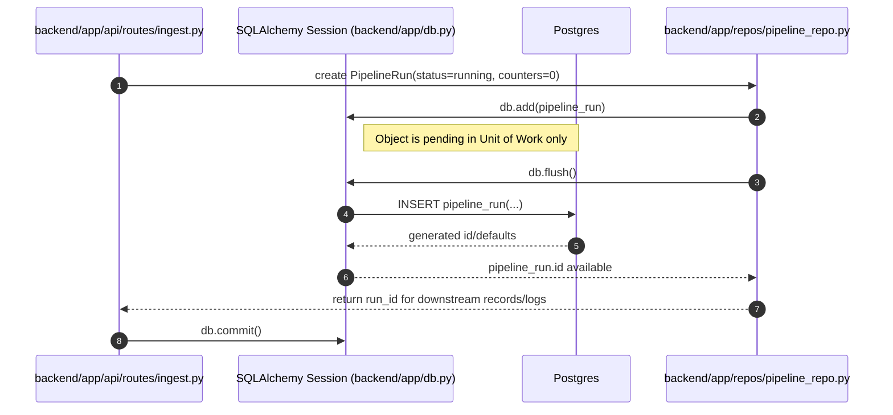

## Autoflush and Commit-Only Path (Mermaid)

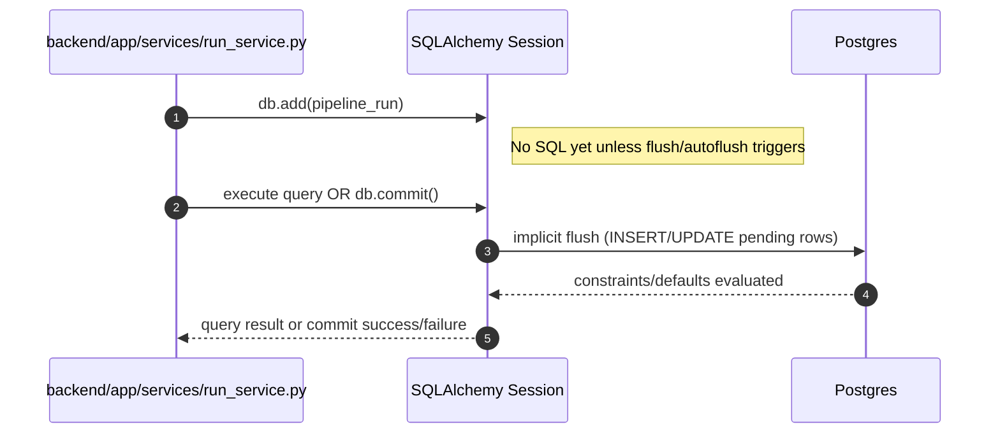

## Implementation Notes

- `db.add()` stages the row in memory; it does not persist immediately.
- `db.flush()` is a transactional write checkpoint, not a durability boundary.
- Use explicit `flush()` when one of these is true:
  - subsequent writes need `pipeline_run.id` in the same transaction.
  - fail-fast behavior is needed before expensive downstream processing.
  - DB-side defaults/triggers must be materialized before building a response payload.
- Skip explicit `flush()` when the code can rely on implicit flush at query/commit and does not depend on generated values yet.
- Keep `commit()` at transaction boundaries so run creation plus related writes remain atomic and rollback-safe.

## Operational Guardrails

- Avoid `flush()` after every `add()`; it increases round trips with little value.
- Treat flush errors (unique/FK/check violations) as expected transactional failures and return deterministic API errors.
- For async orchestration, create `pipeline_run`, flush once to get run id, enqueue tasks, then commit once.

# Edit 6 WHO-Only Hard-Coded Integration (Pre-Implementation Baseline vs Target) 2026-04-26 10:07 Branch: who-surveillance-mvp-v1

## Old ERD (Current State) (Mermaid)

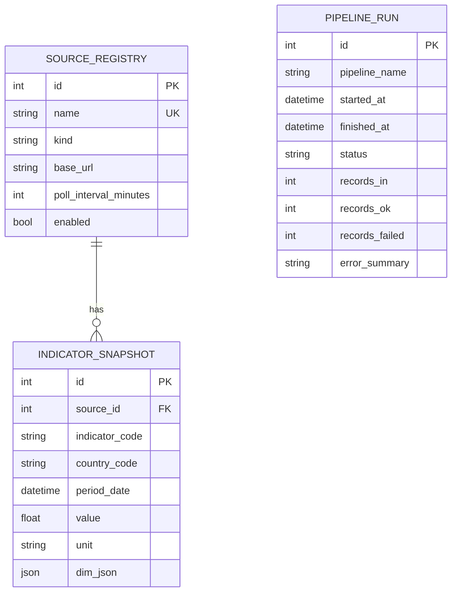

## Old Flow (Current State) (Mermaid)

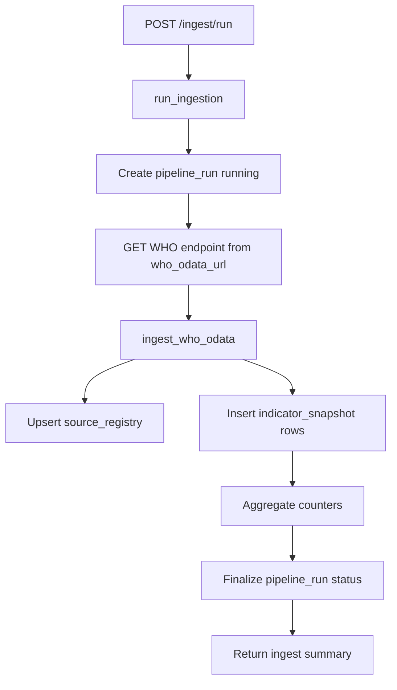

## Old Sequence (Current State) (Mermaid)

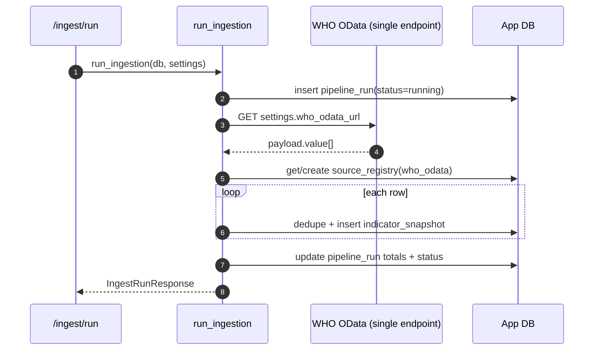

## New ERD (Target for This Implementation) (Mermaid)


Notes:
- No new tables in this step.
- New WHO profile/category metadata is stored in `indicator_snapshot.dim_json`.

## New Flow (Target for This Implementation) (Mermaid)

```mermaid
flowchart TD
    A[POST /ingest/run] --> B[run_ingestion with fixed profile who_surveillance_mvp_v1]
    B --> C[Create pipeline_run running]
    C --> D[Loop hard-coded indicator codes]
    D --> E[GET WHO /api/{IndicatorCode}]
    E --> F[ingest_who_odata code-scoped ingest]
    F --> G[Insert indicator_snapshot with profile and category tags in dim_json]
    G --> H[Collect per-code status and counters]
    H --> I[Finalize pipeline_run aggregate status: ok/partial/error]
    I --> J[Return run summary plus code diagnostics]
    J --> K[GET /runs/{id} for operator readback]
```

## New Sequence (Target for This Implementation) (Mermaid)

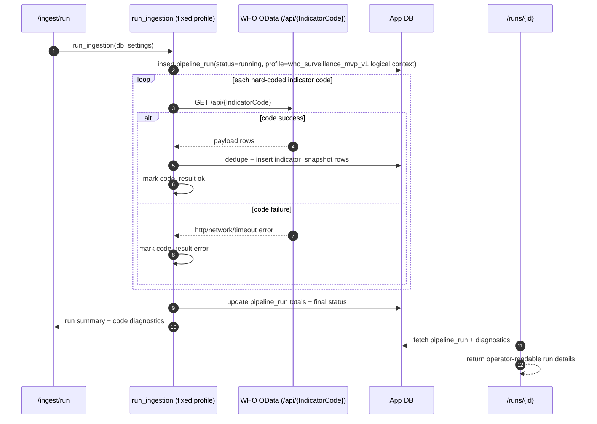
