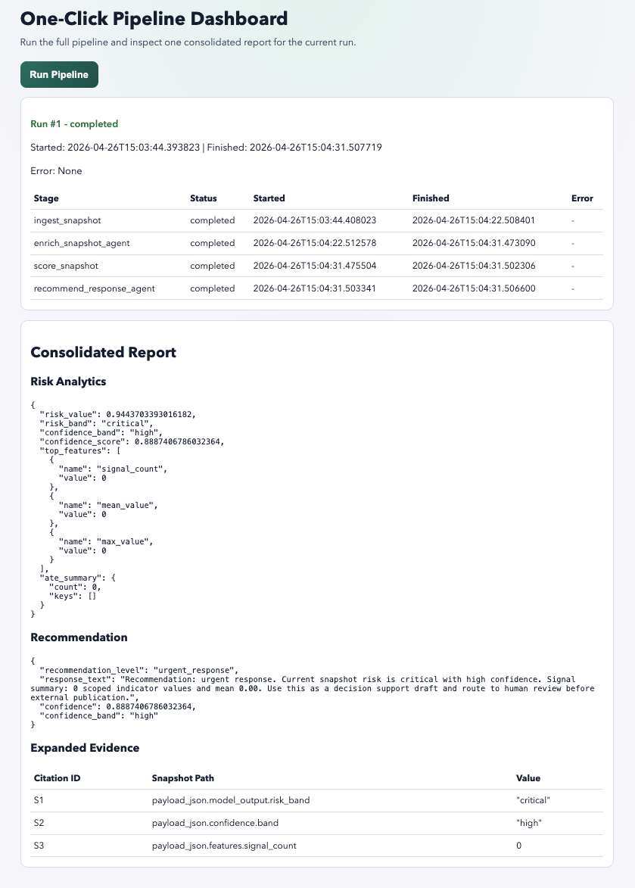

# AIxBioHack 2026: Pandemic Risk Monitoring: Alert, Enrich, Evaluate, Respond

## Abstract

*This project is an attempt to build a pandemic risk monitoring platform with four stages: Alert, connecting verified health professional signals, Enrich, a scalable multiturn agent with search gathering external context, Evaluate, a risk assessment model (double lasso) to score risk and confidence of the alert, and Recommend, actionable next steps an AI agent to produce an auditable response draft with citations so public-health teams can move faster from raw signals to actions recommendations based on explainable models policy makers are familar with. The project ended up scaffolded and is deployable with the pipeline runnable, however, model experiments were not rigorously run nor verified. It serves as an entrypoint to continue transparent open development of explainable, live, grounded, and actionable alerting and response of pandemic risk.*

# Core Problems to solve:

1. **messy global signals → actionable early warnings with importance**
2. **non transparent warning models and data collection which influence policy making such as BlueDot**
3. **Recommendations for responses based on risk assessment (signaling/ flagging is useless without response)**

# ***Our main contributions are:***

1. *Developing a deployable and open platform for pandemic risk monitoring*
2. *Scaffolding an explainable and actionable pipeline aligned with policy makers and modern technology to aggregate natural language data regarding the alert signal in a scalable manner*

## What This Repo Implements

- FastAPI backend that orchestrates a 4-stage pipeline (`pipeline_full_v1`)
- SQLite-backed persistence for runs, stage-level telemetry, enrichment artifacts, ML snapshots, and recommendations
- Vite + TypeScript frontend dashboard that triggers runs and polls live stage status
- ML workspace (`ml/`) for dataset building and model artifact generation used by runtime scoring
- Current ingestion source-of-truth is WHO endpoints only (no additional source connectors are active in runtime)

## Current Runtime Architecture

The canonical runtime flow is:

1. Alert: `ingest_snapshot`
2. Enrich: `enrich_snapshot_agent`
3. Evaluate Risk: `score_snapshot` (double lasso artifact contract)
4. Recommend Next Steps: `recommend_response_agent`

## Dashboard Preview



### Pipeline Orchestration

- Endpoint: `POST /pipeline/run`
- Runner: `backend/app/pipeline/runner/pipeline_runner.py`
- Stage registry: `backend/app/pipeline/registry.py`
- Status and observability:
  - `GET /pipeline/runs/{id}`
  - `GET /pipeline/runs/{id}/events`
  - `pipeline_run`, `pipeline_stage_run`, and `pipeline_run_event` tables

### Stage Responsibilities

- `ingest_snapshot`: pulls WHO OData indicators and writes scoped `indicator_snapshot` rows
- `enrich_snapshot_agent`: runs bounded ReAct-style enrichment, persists findings/report/citations
- `score_snapshot`: loads model artifacts from `ml/models`, derives features, writes `ml_risk_snapshot`
- `recommend_response_agent`: produces recommendation text + structured report + evidence citations

## WHO Ingest Schema (Backend)

Current ingestion profile: `who_surveillance_mvp_v1` (`backend/app/ingest/who_profiles.py`).

WHO OData payload fields consumed from each row:

- `IndicatorCode` (fallback `Indicator`) -> `indicator_snapshot.indicator_code`
- `SpatialDim` (fallback `Country`/`CountryCode`) -> `indicator_snapshot.country_code`
- `Year` (fallback `TimeDimensionValue`/`Dim1`) -> `indicator_snapshot.period_date` (normalized as `YYYY-01-01T00:00:00Z`)
- `NumericValue` (fallback `Value`) -> `indicator_snapshot.value`
- `DisplayValue` -> `indicator_snapshot.unit`
- Full raw row is persisted into `indicator_snapshot.dim_json`

Snapshot scoping metadata persisted in `indicator_snapshot.dim_json`:

- `_profile_name` (example: `who_surveillance_mvp_v1`)
- `_profile_category` (`surveillance_capacity` | `event_signals` | `risk_modifiers`)
- `_snapshot_ref_id` (foreign key reference to ingestion `pipeline_run.id`)

`indicator_snapshot` storage columns:

- `id`
- `source_id`
- `indicator_code`
- `country_code`
- `period_date`
- `value`
- `unit`
- `dim_json`

### Debugging and Stage Isolation

- `GET /debug/stages`: list stage catalog and required inputs
- `POST /debug/stages/{stage}/validate`: validate a stage context without executing
- `POST /debug/stages/{stage}/run`: run a single stage directly

## Data Model Highlights

Key tables used by the production path:

- `pipeline_run`, `pipeline_stage_run`, `pipeline_run_event`
- `indicator_snapshot`
- `enrichment_run`, `context_dump`, `enrichment_finding`, `enrichment_report`, `exa_citation`, `agent_tool_audit`
- `ml_risk_snapshot`, `pipeline_run_score`
- `recommendation_response`

See `Architecture.md` for detailed sequence diagrams and schema evolution notes.

## ML Schema (Training + Runtime)

The backend score stage is aligned to the ML slim feature contract produced in `ml/scripts/preprocess_xy_polars.py`.

Training slim dataset schema (`ml_ready_slim_us.parquet`):

- `record_id`
- `publication_ts`
- `title`
- `f_title_topic_code`
- `f_title_has_outbreak_kw`
- `f_title_word_count`
- `f_pub_quarter`
- `f_title_has_us_kw`
- `target_t72h`
- `intervention_priority_score`

Runtime scoring payload schema persisted in `ml_risk_snapshot.payload_json`:

- `model_output`
- `model_output.risk_value` (float 0..1)
- `model_output.risk_band` (`critical` | `high` | `medium` | `low`)
- `confidence`
- `confidence.band` (`high` | `medium` | `low`)
- `confidence.score` (float 0..1)
- `ates` (dictionary, currently empty in baseline)
- `features`
- `features.f_title_topic_code`
- `features.f_title_has_outbreak_kw`
- `features.f_title_word_count`
- `features.f_pub_quarter`
- `features.f_title_has_us_kw`
- `features.f_case_accel`

## Local Setup

### 1. Environment

Copy `.env.example` to `.env` and fill required values:

- `DATABASE_URL` (example: `sqlite:///./data/app.db`)
- `AZURE_OPENAI_ENDPOINT`
- `AZURE_OPENAI_API_KEY`
- `AZURE_OPENAI_DEPLOYMENT`
- `EXA_API_KEY` (required for live enrichment stage)

### 2. Backend (local)

```bash
cd backend
uv sync
uv run uvicorn app.main:app --host 0.0.0.0 --port 8010 --reload
```

### 3. Frontend (local)

```bash
cd frontend
npm install
npm run dev
```

### 4. Docker Compose

From repo root:

```bash
docker compose up --build
```

- Frontend: `http://127.0.0.1:5173`
- Backend: `http://127.0.0.1:8010`

## API Quickstart

Create a run:

```bash
curl -sS -X POST http://127.0.0.1:8010/pipeline/run \
  -H 'Content-Type: application/json' \
  -d '{"idempotency_key":"demo-001"}'
```

Check status:

```bash
curl -sS http://127.0.0.1:8010/pipeline/runs/<PIPELINE_RUN_ID>
```

Check run events:

```bash
curl -sS http://127.0.0.1:8010/pipeline/runs/<PIPELINE_RUN_ID>/events
```

## Tests

From repo root:

```bash
make test
```

Other targets:

- `make test-unit`
- `make test-contract`
- `make test-integration`
- `make test-live`
- `make test-e2e-live`

## ML Workspace

`ml/` is the training/feature-engineering source-of-truth for current scoring artifacts. See `ml/README.md` for dataset and artifact generation commands.

## Appendix: Limitations and Dual-Use Considerations

### Limitations

- False positives are possible when sparse or noisy indicator snapshots are over-interpreted as elevated risk, especially in low-data regions.
- False negatives are possible when upstream source coverage is incomplete, delayed, or missing context not captured in WHO indicator snapshots.
- Edge cases include schema drift in upstream WHO payloads, missing/invalid dates, country-code inconsistencies, and low-signal periods that reduce model reliability.
- Current scalability is constrained by single-service orchestration, SQLite write patterns, bounded per-run enrichment calls, and synchronous bottlenecks in stage execution.
- Recommendation outputs are decision-support drafts, not validated operational directives, and require human review before external use.

### Dual-Use Risks

- Risk summaries and recommendation outputs could be repurposed to identify surveillance blind spots or timing windows in public-health response systems.
- Automated enrichment and triage could be misused to amplify misinformation if unverified external context is treated as authoritative.
- Any system that ranks risk signals may unintentionally enable selective attention attacks, where adversaries shape visible indicators to manipulate prioritization.

### Responsible Disclosure Recommendations

- If vulnerabilities are discovered (data leakage, prompt/tool abuse paths, unauthorized access, unsafe output behavior), disclose privately to maintainers first with reproduction steps, impact level, and proposed mitigations.
- Avoid public release of exploit details until patches are deployed and affected users have a remediation window.
- Track disclosures in a security log with dates, affected components, fix status, and verification evidence.
- Implement and publish a coordinated disclosure policy with a dedicated security contact and target response timelines.

### Ethical Considerations

- Maintain human-in-the-loop review for high-impact outputs, especially recommendations that may influence public communication or resource allocation.
- Prioritize transparency: preserve citations, confidence bands, and provenance so operators can challenge or override model outputs.
- Minimize harm from automation bias by presenting uncertainty and failure modes explicitly, not just single-score rankings.
- Use least-privilege access patterns for external tools and data, and avoid collecting unnecessary personally identifiable information.
- Evaluate for geographic and reporting bias so low-resource regions are not systematically deprioritized by data availability artifacts.

### Suggestions for Future Improvements

- Make double lasso evaluation more robust with explainable policy aligned structure models
- Scale and have strong filter and verfication for the enrichment agent.
- Connect enrichment NLP data to double lasso/ double ml risk evaluation
- Semantic IDs or Generative recommendation systems fine tuned for decision making / policy align ment
- Intergrate other verifiable sources such as HealthMap and ProMED into Alert stage data.
